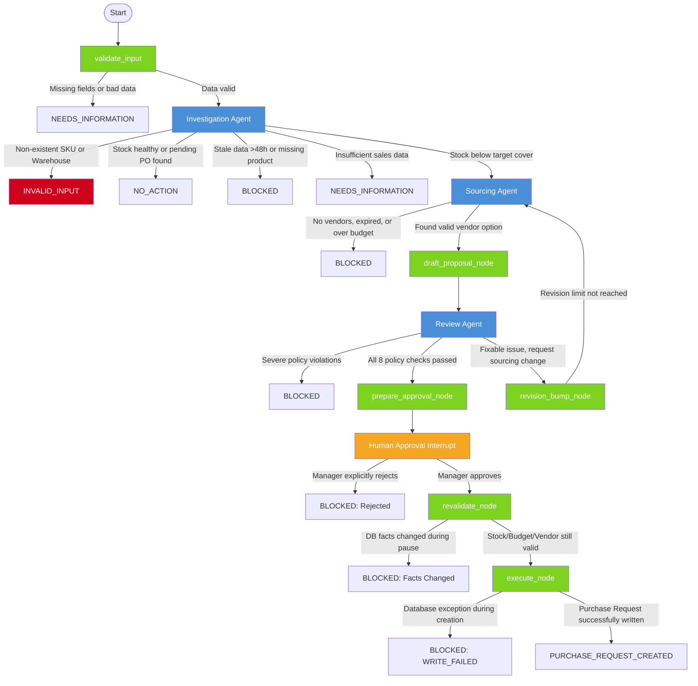

# OptiStock AI System Design

This document contains the design details for the OptiStock AI- multi-agent stockout resolution system.

## 1. Architecture Graph



*Blue nodes are LLM agents. Green nodes are deterministic functions. Orange is the human interrupt. Red is the INVALID_INPUT terminal.*

---

## 2. Agent Charters

### Agent 1: Investigation Agent

| Property | Detail |
|---|---|
| **Objective** | Investigate one SKU at one warehouse. Determine if replenishment action is needed, or if an existing purchase order already covers the gap. |
| **Input** | `sku`, `warehouse_id`, `target_cover_days` (from `OptiStockState`) |
| **Output Schema** | `InvestigationResult` — Pydantic model with status, cover_days, at_risk, projected_stockout_date, evidence IDs, reasoning |
| **Permissions** | Read-only access to inventory, sales, and purchase order data. No vendor, policy, or write access. |

**Tools (6):**

| Tool | Purpose |
|---|---|
| `get_product` | Verify the SKU exists and is active |
| `get_warehouse` | Verify the warehouse exists |
| `get_stock_position` | Fetch latest inventory snapshot (on_hand, reserved, confirmed_inbound) |
| `get_sales_velocity` | Get 7-day and 30-day daily sales averages |
| `calculate_stock_risk` | Deterministic risk calculation (cover_days, at_risk, projected_stockout_date) |
| `get_pending_purchase_orders` | Check for existing PENDING/CONFIRMED purchase orders for the same SKU+warehouse |

**Decision Logic:**

```
1. Deterministic pre-flight: call get_product and get_stock_position directly (no LLM).
   - If SKU not found → INVALID_INPUT (exit immediately, no LLM call)
   - If warehouse has no stock record → INVALID_INPUT (exit immediately, no LLM call)
2. LLM ReAct loop begins:
   a. get_product → verify active
   b. get_stock_position → get inventory snapshot
   c. get_sales_velocity → get daily velocity
   d. calculate_stock_risk → determine cover_days, at_risk, stale
   e. If at_risk = true → MUST call get_pending_purchase_orders
3. Final status determination:
   - NOT_FOUND → INVALID_INPUT
   - INACTIVE → BLOCKED
   - INSUFFICIENT_DATA → NEEDS_INFORMATION
   - stale = true → BLOCKED (DATA_STALE)
   - at_risk = false → NO_ACTION
   - at_risk = true + pending PO arrives before stockout → NO_ACTION (cite pending PO)
   - at_risk = true + no covering PO → AT_RISK
```

**Failure Behavior:**
- Missing/invalid SKU or warehouse → `INVALID_INPUT` (deterministic, no LLM cost)
- Stale inventory data (>48h) → `BLOCKED` with `DATA_STALE`
- Insufficient sales history → `NEEDS_INFORMATION`
- LLM output validation failure → `BLOCKED` with error detail
- Existing purchase order covers gap → `NO_ACTION` with reasoning

---

### Agent 2: Sourcing Agent

| Property | Detail |
|---|---|
| **Objective** | Find and evaluate vendor options for an at-risk SKU. Recommend a vendor with a clear cost-vs-speed trade-off explanation. |
| **Input** | `InvestigationResult` context, `target_cover_days`, `revision_count`, `review_result` (on revisions) |
| **Output Schema** | `SourcingResult` — Pydantic model with status, recommended_vendor_id/name, quantity, unit_price, total_cost, budget info, trade-off explanation, all_options_summary |
| **Permissions** | Read-only access to vendor offers, vendor performance, and budget data. No inventory, policy, or write access. |

**Tools (5):**

| Tool | Purpose |
|---|---|
| `list_vendor_offers` | Fetch active, valid offers for the SKU |
| `get_vendor_performance` | Retrieve reliability metrics (on-time rate, fill rate, quality score) |
| `build_vendor_options` | Deterministic ranking of all vendor options by cost |
| `recommend_vendor_option` | Select the best option using a strategy (balanced/cheapest/fastest) |
| `get_budget_position` | Check remaining monthly budget for the warehouse |

**Decision Logic:**

```
1. list_vendor_offers → get all active offers
2. get_vendor_performance → reliability for each vendor
3. build_vendor_options → rank and filter options
4. get_budget_position → check budget headroom
5. recommend_vendor_option → pick best option using strategy:
   - "balanced" (default)
   - "fastest" if stockout is imminent
   - "cheapest" if budget is tight
6. Status determination:
   - No active offers → BLOCKED
   - No eligible vendors (unreliable/miss deadline) → BLOCKED
   - Cost > budget → BLOCKED (over-budget)
   - Recommendation fits budget → PROPOSAL_READY
```

**Revision Handling:** When `revision_count > 0`, the agent receives the Review Agent's violations and reasoning as additional context, prompting it to adjust its recommendation (e.g., pick a faster vendor, reduce quantity).

**Failure Behavior:**
- No offers or all expired → `BLOCKED`
- Over budget → `BLOCKED`
- Missing vendor/budget data → `NEEDS_INFORMATION`
- LLM output validation failure → `BLOCKED` with error detail

---

### Agent 3: Review Agent

| Property | Detail |
|---|---|
| **Objective** | Review the replenishment proposal against the procurement policy (`policy.md`). Decide if it proceeds to human approval, needs revision, or must be blocked. |
| **Input** | Full `ReplenishmentProposal`, `InvestigationResult`, `SourcingResult`, evidence from state |
| **Output Schema** | `ReviewResult` — Pydantic model with status, policy_passed, policy_violations, policy_questions_answered (Q1–Q8), timing/budget acceptability, reasoning, recommendation_for_approver |
| **Permissions** | Access to `policy.md` via `get_policy_guidance` ONLY. No direct database queries. |

**Tools (1):**

| Tool | Purpose |
|---|---|
| `get_policy_guidance` | Load the current `policy.md` document for the SKU/warehouse/target combination |

**The 8 Policy Questions (answered explicitly in output):**

| # | Question |
|---|---|
| Q1 | Is the inventory snapshot fresh enough? (threshold: 48h) |
| Q2 | Is the SKU actually at risk? (check at_risk flag) |
| Q3 | Is the sales evidence sufficient? (observation counts) |
| Q4 | Are there valid vendor options? (eligible options list) |
| Q5 | Which trade-off is being made? (cost vs speed vs balanced) |
| Q6 | Does the proposed arrival beat the projected stockout date? |
| Q7 | Does the proposed cost fit the remaining monthly budget? |
| Q8 | Is the proposal grounded in evidence IDs? (full traceability) |

**Decision Logic:**

```
1. Call get_policy_guidance to load policy.md
2. Answer each of Q1–Q8 using ONLY evidence from the proposal and tool outputs
3. Status determination:
   - All 8 pass → APPROVED_FOR_HUMAN
   - Budget/timing fixable by sourcing agent → NEEDS_REVISION
   - Unresolvable (stale data, no vendors, impossible timing) → BLOCKED
```

**Recommendation for Approver:** The `recommendation_for_approver` field is rendered directly in the Streamlit UI under "Agent Reasoning" in the Human Decision section. It includes: why the vendor was selected, why the quantity is what it is, cost breakdown with per-unit cost, estimated delivery date, and key policy details.

**Failure Behavior:**
- Severe policy violations → `BLOCKED`
- Fixable concerns (e.g., choose faster vendor) → `NEEDS_REVISION`
- LLM output validation failure → `BLOCKED` with error detail

---

## 3. Tool-Permission Matrix

| Tool | Investigation | Sourcing | Review | Deterministic Nodes |
|---|:---:|:---:|:---:|:---:|
| `get_product` | ✅ | ❌ | ❌ | ❌ |
| `get_warehouse` | ✅ | ❌ | ❌ | ❌ |
| `get_stock_position` | ✅ | ❌ | ❌ | ✅ (Revalidate) |
| `get_sales_velocity` | ✅ | ❌ | ❌ | ❌ |
| `calculate_stock_risk` | ✅ | ❌ | ❌ | ❌ |
| `get_pending_purchase_orders` | ✅ | ❌ | ❌ | ❌ |
| `list_vendor_offers` | ❌ | ✅ | ❌ | ✅ (Revalidate) |
| `get_vendor_performance` | ❌ | ✅ | ❌ | ❌ |
| `build_vendor_options` | ❌ | ✅ | ❌ | ❌ |
| `recommend_vendor_option` | ❌ | ✅ | ❌ | ❌ |
| `get_budget_position` | ❌ | ✅ | ❌ | ✅ (Revalidate) |
| `get_policy_guidance` | ❌ | ❌ | ✅ | ❌ |
| `draft_replenishment_proposal`| ❌ | ❌ | ❌ | ✅ (Draft node) |
| `prepare_approval_request` | ❌ | ❌ | ❌ | ✅ (Approval node)|
| `create_purchase_request` | ❌ | ❌ | ❌ | ✅ (Execute node) |
| `append_audit_event` | ❌ | ❌ | ❌ | ✅ (All nodes) |

**Enforcement:** Each agent file defines a `_*_TOOL_NAMES` frozenset that filters the global tool registry. Agents never see tools outside their allowlist.

---

## 4. Shared State Design

See [`state.py`](state/state.py). The state uses `TypedDict` and is serializable (all Pydantic models are dumped to dicts) so LangGraph can persist it across the human interrupt.

### State Categories

| Category | Keys | Purpose |
|---|---|---|
| **Input** | `case_id`, `trace_id`, `sku`, `warehouse_id`, `target_cover_days` | Immutable request fields |
| **Investigation Evidence** | `product`, `stock_position`, `sales_velocity`, `stock_risk`, `investigation_result` | Evidence gathered by Investigation Agent |
| **Sourcing Evidence** | `vendor_offers`, `vendor_performance`, `vendor_options`, `vendor_recommendation`, `budget_position`, `sourcing_result` | Evidence gathered by Sourcing Agent |
| **Proposal** | `proposal`, `proposal_hash` | Assembled ReplenishmentProposal and its SHA256 integrity hash |
| **Review** | `review_result`, `policy_guidance` | Review Agent output and loaded policy text |
| **Approval** | `approval_request`, `approval_decision`, `approved_by` | Human interrupt payload and response |
| **Execution** | `revalidation_result`, `purchase_request`, `idempotency_key` | Post-approval revalidation and write result |
| **Workflow Control** | `outcome`, `error_code`, `error_message`, `retry_count`, `revision_count` | Terminal status, error tracking, loop guards |
| **Audit** | `audit_events` | Accumulated list of audit event IDs |
| **Messages** | `messages` | LangGraph `add_messages` reducer for agent conversation history |

### Isolation Guarantees

- Agents write only to their own result keys (`investigation_result`, `sourcing_result`, `review_result`). No agent mutates another agent's evidence.
- The `proposal` key is only written by the deterministic `draft_proposal_node`.
- The `purchase_request` key is only written by the deterministic `execute_node`.
- The `outcome` field is authoritative — once set, the `terminal_node` preserves it.

---

## 5. Deterministic Nodes

| Node | File | Purpose |
|---|---|---|
| `validate_input_node` | `nodes/validate_input.py` | Checks SKU/warehouse_id are non-empty strings and target_cover_days is within [7, 45]. No DB queries. |
| `draft_proposal_node` | `nodes/draft_proposal.py` | Assembles a `ReplenishmentProposal` from typed evidence. Pure data mapping, no LLM. |
| `prepare_approval_node` | `nodes/prepare_approval.py` | Packages the proposal into an `ApprovalRequest` for the human interrupt. |
| `human_approval_node` | `graph.py` | Calls `interrupt()` to pause the graph. Logs the decision and routes to revalidation or terminal. |
| `revision_bump_node` | `graph.py` | Increments `revision_count` before looping back to sourcing. |
| `revalidate_node` | `nodes/revalidate.py` | Re-queries DB for stock freshness (<48h), vendor offer validity, and budget sufficiency. |
| `execute_node` | `nodes/execute.py` | Writes the purchase request with an idempotency key. Stores `expected_arrival_date`. |
| `terminal_node` | `graph.py` | Ensures `outcome` is set and logs a `case_closed` audit event. |
| `audit_node` | `nodes/audit.py` | Appends structured audit events to the `audit_events` table. Called by every node. |

---

## 6. Possible Case Outcomes

| Outcome | Meaning | Set By |
|---|---|---|
| `NO_ACTION` | Stock is healthy, or an existing purchase order covers the gap | Investigation Agent |
| `NEEDS_INFORMATION` | Required fields missing, or insufficient sales data | validate_input / Investigation Agent |
| `INVALID_INPUT` | Non-existent SKU or warehouse ID | Investigation Agent (deterministic pre-flight) |
| `BLOCKED` | Stale data, inactive product, no vendors, over budget, policy violation, rejection, revalidation failure, or write error | Any agent or deterministic node |
| `AWAITING_APPROVAL` | Proposal awaiting human decision | prepare_approval_node |
| `PURCHASE_REQUEST_CREATED` | Full success: approved, revalidated, and written | execute_node |

---

## 7. Design Decisions

### Why not make everything agentic?

We deliberately chose to use **deterministic code** for critical operations:

| Operation | Why deterministic? |
|---|---|
| **Input validation** (`validate_input_node`) | Checking if a string is empty or an integer is in range [7, 45] is trivial logic. An LLM would be wasteful and unreliable. |
| **SKU/warehouse existence** (pre-flight in `investigation_agent_node`) | We call `get_product` and `get_stock_position` deterministically *before* the LLM loop. If either returns `NOT_FOUND`, we short-circuit to `INVALID_INPUT` without spending an LLM call. |
| **Proposal drafting** (`draft_proposal_node`) | The proposal structure is rigid. Assembling typed fields into a `ReplenishmentProposal` Pydantic model is mechanical data mapping. |
| **Revalidation** (`revalidate_node`) | Checking if stock age < 48h, if a vendor offer still exists, and if budget is sufficient is simple arithmetic. An LLM cannot do this more reliably. |
| **Purchase request creation** (`execute_node`) | An LLM should never directly write to a database. It can hallucinate fields or ignore idempotency rules. The idempotency key (`case_id:proposal_hash`) prevents duplicate writes. |
| **Audit logging** (`audit_node`) | Every node calls the same deterministic helper. Structured payloads are written to the `audit_events` table without exposing chain-of-thought or secrets. |

### Why the Investigation Agent needs an LLM

The Investigation Agent uses an LLM because it must *interpret* multiple tool outputs in combination — deciding whether velocity trends, stock levels, and inbound quantities collectively imply risk. It also must produce human-readable reasoning that cites specific evidence IDs and explains projected dates. However, the pre-flight validation (SKU/warehouse existence) is handled deterministically to avoid wasting API calls on obviously invalid requests.

### Why the Sourcing Agent needs an LLM

The Sourcing Agent must reason about trade-offs: when stockout is imminent but the cheapest vendor is too slow, it must articulate *why* it chose a more expensive but faster option. The `recommend_vendor_option` tool provides a structured recommendation, but the agent adds the narrative explaining the choice, which is essential for the human approver.

### Why the Review Agent needs an LLM

The Review Agent reads `policy.md` — a natural-language document — and applies its guidance to a specific proposal. This requires genuine language comprehension. The agent must produce structured answers to 8 policy questions, each grounded in specific evidence. No deterministic rule engine could replicate this flexibility without becoming a fragile if/else tree.

### Duplicate Purchase Order Prevention

When the Investigation Agent determines a SKU is `AT_RISK`, it calls `get_pending_purchase_orders` to check for existing active (`PENDING` or `CONFIRMED`) purchase orders. If an order exists that will arrive before the projected stockout date, the agent returns `NO_ACTION` with clear reasoning, preventing unnecessary duplicate orders. This handles the real-world scenario where a recently placed order has not yet been reflected in the warehouse's `confirmed_inbound` inventory count.

### Bounded Revision

If the Review Agent finds fixable concerns (e.g., choose a faster vendor), it sets status to `NEEDS_REVISION`. The graph routes back to the Sourcing Agent with the reviewer's violations and reasoning as additional context. To prevent infinite loops, `revision_count` is incremented by `revision_bump_node`. The graph enforces a maximum of **1 revision** (configurable via `MAX_REVISION_COUNT`). After that, the case is forced to `BLOCKED`.

### Revalidation After Human Approval

After a human approves the proposal, `revalidate_node` re-queries the database to check whether facts changed during the pause:
1. **Stock freshness:** Is the inventory snapshot still < 48 hours old?
2. **Vendor offer validity:** Does the recommended vendor still have an active offer?
3. **Budget sufficiency:** Is the remaining budget still >= total cost?

If any check fails, the case is routed to `BLOCKED` with a clear error message. This ensures that a stale approval does not result in an invalid purchase.

### Idempotency

The `execute_node` generates an idempotency key from `case_id:proposal_hash`. If the same key is submitted twice (e.g., due to a retry or network failure), the database returns the existing purchase request instead of creating a duplicate.

Additionally, `create_purchase_request` now stores `expected_arrival_date` (computed from the proposal's `expected_arrival` field), enabling the duplicate PO detection described above.

---

## 8. Configurable Thresholds

All thresholds are stored in [`config.py`](config.py) and loaded from environment variables. None are hidden inside prompts.

| Threshold | Default | Source |
|---|---|---|
| `DATA_FRESHNESS_THRESHOLD_HOURS` | 48 | `DATA_FRESHNESS_THRESHOLD` env var |
| `DEFAULT_TARGET_COVER_DAYS` | 14 | `DEFAULT_TARGET_COVER_DAYS` env var |
| `TARGET_COVER_DAYS_MIN` | 7 | Hardcoded (business rule) |
| `TARGET_COVER_DAYS_MAX` | 45 | Hardcoded (business rule) |
| `VENDOR_RELIABILITY_THRESHOLD` | 0.90 | Hardcoded (business rule) |
| `MAX_REVISION_COUNT` | 1 | Hardcoded (bounded revision) |
| `MAX_AGENT_RETRIES` | 1 | `MAX_AGENT_RETRIES` env var |

---

## 9. Observability & Audit Trail

Every node (agent and deterministic) calls `audit_node()`, which writes a structured event to the `audit_events` SQL table via `append_audit_event()`. Each event contains:

- `event_id`: Unique identifier
- `case_id`: Links to the current case
- `trace_id`: Links to the distributed trace
- `actor`: Who emitted the event (e.g., `agent:investigation`, `system:execution`, `human:reviewer`)
- `event_type`: Structured type (e.g., `investigation_completed`, `proposal_drafted`, `approval_decision`, `purchase_request_created`, `case_closed`)
- `payload_json`: JSON-encoded event body with relevant facts

**What is NOT logged:** Private chain-of-thought, API keys, raw LLM responses, or any sensitive data.

**Reconstructability:** An operator can reconstruct the complete decision trail for any case by querying `SELECT * FROM audit_events WHERE case_id = ? ORDER BY created_at`.

---

## 10. Acceptance Scenarios

| # | Scenario | Test Case / SKU | Expected Outcome |
|---|---|---|---|
| 1 | Healthy stock | `AC-001` | `NO_ACTION` — stock covers well beyond target |
| 2 | Missing required data | `None` SKU | `NEEDS_INFORMATION` — blocked by deterministic validation |
| 3 | Stale inventory data | `AC-002` | `BLOCKED` — snapshot older than 48h |
| 4 | Speed-vs-cost trade-off | `AC-003` | `AWAITING_APPROVAL` → `PURCHASE_REQUEST_CREATED` |
| 5 | Over-budget proposal | `AC-004` | `BLOCKED` — total cost exceeds remaining budget |
| 6 | Invalid agent output | Any | `BLOCKED` — validation retry limit exceeded |
| 7 | Data changed post-approval | `AC-003` | `BLOCKED` — revalidation fails due to hash/fact change |
| 8 | Duplicate approval (Idempotency)| `AC-003` | `PURCHASE_REQUEST_CREATED` — duplicate write skipped safely |
| 9 | Human rejection | Any AT_RISK case | `BLOCKED` — rejected by approver |
| 10 | DB write failure | `AC-003` | `BLOCKED` — execute_node handles exceptions safely |
| 11 | Insufficient sales history | `AC-005` | `NEEDS_INFORMATION` — only 14 days of data |
| 12 | Unreliable/expired vendors | `AC-006` | `BLOCKED` — no eligible vendors |
| 13 | Non-existent SKU | `FAKE-SKU-999` | `INVALID_INPUT` — deterministic rejection |
| 14 | Non-existent warehouse | `FAKE-WH` | `INVALID_INPUT` — deterministic rejection |
| 15 | Duplicate purchase order | `AC-007` | `NO_ACTION` — pending PO arrives before stockout |

